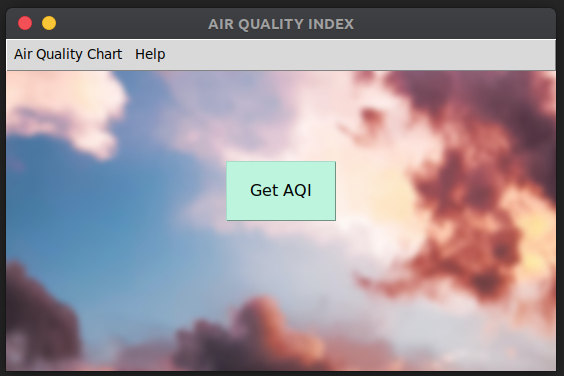

# Air Quality Index Python App

AQI Python App displays the air pollution index of your city. This app uses the Air Visual API to retrieve the information as per your location. See the requirements section before running this app.

## Screenshot

## Suggestion

If you have any suggestion, please make a pull request
